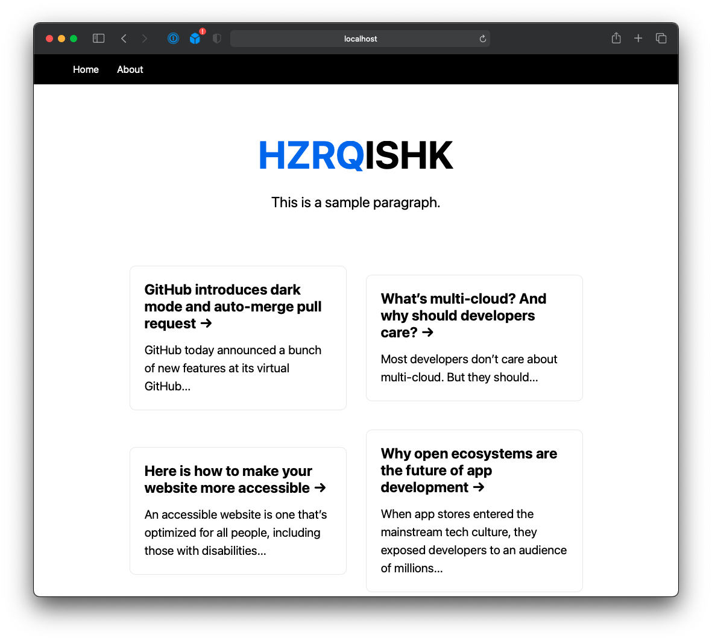

# Next Crash Course

Exploring Next.js. Running on top of React, Next.js allow the page to load on the server side, instead of the client. This is good for SEO as well as the web performance.

- Easy page routing
- API routes
- Easy deployment

## YouTube Video

- [YouTube URL](https://www.youtube.com/watch?v=mTz0GXj8NN0)

## GitHub Repo

- [GitHub Repo](https://github.com/bradtraversy/next-crash-course)

## Setup

```jsx
npx create-next-app next-crash-course
```

## Serve

```jsx
sudo npm i -g serve

serve -s out -p 3011
```

## Outcome


